# Trigger Map: carlossimpore.com

## Strategy Overview

This Trigger Map connects the **"Hybrid-Engine" Architect** vision to the psychological drivers of our primary target groups. We are prioritizing **Speed-to-Value (The 10s Flow)** as the primary conversion trigger, supported by **Architectural Resilience** and **Live Autonomy** as trust-builders.

---

## 1. Business Goals

### Vision
> "To be the globally recognized leader of the **'Hybrid-Engine'**—the definitive reference for extraordinary, resilient, and AI-autonomous business solutions that redefine what's possible."

### Objectives (SMART)
- **O1: Conversion**: Onboard 5 high-value clients for "Hybrid-Engine" audits/builds within 6 months of launch.
- **O2: Engagement**: Achieve 80% "Value-Clarity" rate for visitors within their first session.
- **O3: Growth**: Establish 3 strategic partnerships with top-tier tech leads/agencies by end of 2026.
- **O4: Authority**: Generate 10+ qualified inquiries per month via interactive Proof-of-Concept labs.

---

## 2. Target Groups & Driving Forces

### Persona A: Solopreneur Sam (The Scale-Hunter)
**Strategic Role**: The primary source of high-frequency conversion.
- **Push (Driving Away)**: Manual sync burnout, fragile/brittle automation, scaling anxiety.
- **Pull (Drawing Toward)**: Peace of mind, "Autonomous Engine" reliability, reclaiming 10+ hours/week.

### Persona B: Tech-Lead Tanya (The Partnership Scout)
**Strategic Role**: The gateway to high-stakes, high-budget strategic partnerships.
- **Push (Driving Away)**: Surface-level AI "prompt-engineers," technical debt, scalability bottlenecks.
- **Pull (Drawing Toward)**: "Titan-grade" engineering (Offline-first), robust architecture, mission-critical reliability.

---

## 3. Prioritization & Trigger Map

We focus our design decisions on the **Impact/Effort** intersection where innovation meets business ROI.

### Strategic Triggers
1.  **The "10s Flow" (Primary)**: Showcasing the transformation of friction into flow.
2.  **The "Autonomy Lab" (Secondary)**: Real-time telemetry proving the systems are alive.
3.  **The "Resilience Bedrock" (Foundation)**: Deep-dive architecture diagrams for technical vetting.

### Trigger Relationship Diagram

```mermaid
graph TD
    subgraph "Business Goals"
        G1[O1: 5 High-Value Clients]
        G2[O2: 80% Value Clarity]
        G3[O3: 3 Strategic Partners]
    end

    subgraph "Target Groups"
        P1["Solopreneur Sam (Scale-Hunter)"]
        P2["Tech-Lead Tanya (Partnership Scout)"]
    end

    subgraph "Driving Forces"
        F1["Push: Brittle Tech & Burnout"]
        F2["Pull: Autonomous Peace of Mind"]
        F3["Push: Surface-level AI Devs"]
        F4["Pull: Titan-grade Resilience"]
    end

    subgraph "Triggers (Design Focus)"
        T1["T1: The 10s Flow (Impact: 10/10)"]
        T2["T2: Autonomy Lab (Impact: 8/10)"]
        T3["T3: Resilience Bedrock (Impact: 7/10)"]
    end

    P1 -- Driven by --> F1
    P1 -- Attracted by --> F2
    P2 -- Driven by --> F3
    P2 -- Attracted by --> F4

    F1 & F2 --> T1
    F3 & F4 --> T2
    F4 --> T3

    T1 --> G1 & G2
    T2 & T3 --> G3
```

---

**Status:** Trigger Map Complete
**Next Phase:** UX Scenarios (Phase 3)
**Last Updated:** 2026-04-09
